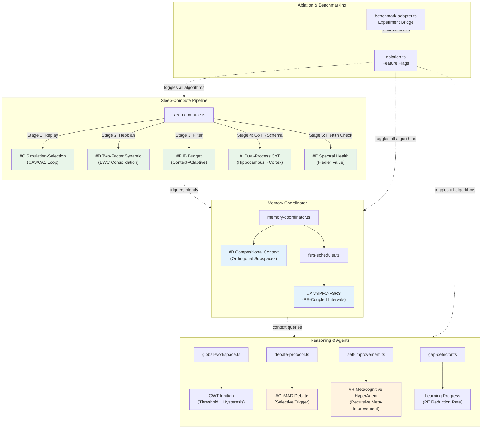

# NeurIPS 2026: 9 Algorithmic Innovations

> **ZenBrain's 9 scientifically-grounded algorithmic innovations for the NeurIPS 2026 full paper submission.**
> Each algorithm upgrades an existing component with a peer-reviewed neuroscience/math foundation.

---

## Overview Table

| # | Name | Paper Reference | Implementation | Production Callsite | Test File |
|---|------|----------------|----------------|---------------------|-----------|
| **A** | vmPFC Prediction-Error Coupled FSRS | Zou et al., Cell Reports 2025 | `backend/src/algorithms/fsrs-vmPFC.ts` | `backend/src/services/memory/fsrs-scheduler.ts` | `backend/src/__tests__/unit/algorithms/fsrs-vmPFC.test.ts` |
| **B** | Compositional Context Embeddings | Nature 2025 (Compositional PFC) + bioRxiv 2025 (Orthogonal Neural Codes) | `backend/src/services/memory/compositional-context.ts` | `backend/src/services/memory/memory-coordinator.ts` | `backend/src/__tests__/unit/services/memory/compositional-context.test.ts` |
| **C** | Simulation-Selection Sleep Loop | Frontiers in Computational Neuroscience 2025 | `backend/src/algorithms/sleep-simulation-selection.ts` | `backend/src/services/memory/sleep-compute.ts` | `backend/src/__tests__/unit/algorithms/sleep-simulation-selection.test.ts` |
| **D** | Two-Factor Synaptic Model | Zenke et al., PNAS 2025 | `backend/src/algorithms/hebbian-two-factor.ts` | `backend/src/services/memory/sleep-compute.ts` | `backend/src/__tests__/unit/algorithms/hebbian-two-factor.test.ts` |
| **E** | Spectral KG Health Monitor | Nat. Comms. 2023 (Causal Hubs) + Spectral Graph Theory | `backend/src/algorithms/spectral-health.ts` | `backend/src/services/memory/sleep-compute.ts` | `backend/src/__tests__/unit/algorithms/spectral-health.test.ts` |
| **F** | Context-Adaptive IB Budget | MemFly, Feb 2026 (Information Bottleneck) | `backend/src/algorithms/ib-budget.ts` | `backend/src/services/memory/sleep-compute.ts` | `backend/src/__tests__/unit/algorithms/ib-budget.test.ts` |
| **G** | iMAD Selective Debate | arXiv 2511.11306, Nov 2025 | `backend/src/services/agents/imad-debate.ts` | `backend/src/services/agents/debate-protocol.ts` | `backend/src/__tests__/unit/services/agents/imad-debate.test.ts` |
| **H** | Metacognitive HyperAgent | arXiv 2603.19461, Meta AI, Mar 2026 | `backend/src/services/agents/metacognitive-hyperagent.ts` | `backend/src/services/integration/self-improvement.ts` | `backend/src/__tests__/unit/services/agents/metacognitive-hyperagent.test.ts` |
| **I** | Dual-Process CoT Consolidation | arXiv Jul 2025 (Dual-Process Compositional Learning) | `backend/src/services/memory/dual-process-consolidation.ts` | `backend/src/services/memory/sleep-compute.ts` | `backend/src/__tests__/unit/services/memory/dual-process-consolidation.test.ts` |

**Engineering additions** (not CODE TASKs, but required for ablation/benchmarking):
- **Ablation Toggle Registry:** `backend/src/algorithms/ablation.ts` — Feature flags for NeurIPS ablation studies
- **Benchmark Adapter:** `backend/src/algorithms/benchmark-adapter.ts` — Bridges algorithms with the experiment harness
- **GWT Ignition Mechanism:** `backend/src/services/reasoning/gwt-ignition.ts` — Ignition threshold + hysteresis for Global Workspace (Nature 2025, Frontiers 2025)
- **Learning Progress Signal:** `backend/src/services/curiosity/learning-progress.ts` — Curiosity-driven exploration by PE reduction rate

---

## Algorithm Descriptions

### #A — vmPFC Prediction-Error Coupled FSRS

Couples FSRS interval scheduling with a Knowledge Graph-derived prediction error (PE) signal, inspired by 7T fMRI evidence that vmPFC re-encoding similarity — not repetition count — predicts spaced learning benefits. Low PE at review extends the interval (no re-encoding potential); high PE shortens it (ideal learning window). This is the first biologically-motivated adaptive FSRS extension — no equivalent exists in Anki, SuperMemo, FSRS-5, or any other SRS system.

### #B — Compositional Context Embeddings

Replaces pure database schema isolation with orthogonal subspace encoding inspired by how prefrontal cortex encodes task context and spatial memory in separate neural subspaces. Memory encoding uses `h(c,m) = P_shared * e_m + Q_c * c_c` where P_shared is a shared low-dimensional memory subspace and Q_c is the orthogonal context subspace (P^T * Q = 0). This enables cross-context transfer (e.g., learning to work) without context contamination.

### #C — Simulation-Selection Sleep Loop

Implements a two-stage offline RL model of memory consolidation. Stage 1 (CA3-analog) generates diverse replay candidates from the episodic buffer, including counterfactual extrapolations of failed episodes. Stage 2 (CA1-analog) scores candidates by TD-value using a composite tag score `Tag(e) = alpha * |delta_TD| + beta * R + gamma * N`, then applies selective LTP (strengthening) for high-value and LTD (decay) for low-value replays.

### #D — Two-Factor Synaptic Model

Extends KG edges from single-weight to (weight, variance) pairs. Variance decreases with activation frequency (maturation), making mature edges robust against overwriting. The importance score `1/variance` serves as a Fisher Information proxy, making this mathematically equivalent to Elastic Weight Consolidation (EWC) with biologically-derived importance scores. Includes `computeEWCPenalty()` for continual learning protection.

### #E — Spectral KG Health Monitor

Uses algebraic connectivity (Fiedler value, lambda_2) of the Graph Laplacian as a post-sleep consolidation quality metric. A rising lambda_2 after sleep indicates successful consolidation (strengthened connections); a falling lambda_2 indicates fragmentation (alert condition). Computes the full Laplacian `L = D - A` and extracts the second-smallest eigenvalue via QR iteration.

### #F — Context-Adaptive Information Bottleneck Budget

Applies the Information Bottleneck principle with context-dependent beta parameters: `retain if I(Z;Y) * beta > I(X;Z)`. Work context uses beta=0.8 (high relevance retention), learning=0.6 (balanced compression creates abstraction), personal=0.4 (forgetting irrelevant data is desired), creative=0.3 (maximum compression to concepts). This gives each context its own optimal information-retention curve.

### #G — iMAD Selective Debate Protocol

Reduces Multi-Agent Debate (MAD) token costs by ~92% while improving accuracy by ~13.5%. A single agent first generates structured self-critique; hesitation features (confidence gap, hedging language, contradictions) are extracted and fed to a lightweight classifier that decides whether to trigger full debate or accept the initial response. This wraps around the existing debate protocol as a selective-trigger layer.

### #H — Metacognitive HyperAgent

Extends the DGM-H framework with governance-layer safety guarantees, persistent meta-memory via ZenBrain, and budget-constrained execution (max 3 meta-improvements per day). The key innovation is recursive metacognition: the system doesn't just improve task performance — it improves the improvement mechanism itself by analyzing strategy performance patterns and generating meta-insights.

### #I — Dual-Process CoT Consolidation

Formalizes the path from Chain-of-Thought to persistent knowledge: Phase 1 (Hippocampal) stores reasoning chains in episodic memory with high fidelity. Phase 2 (Cortical, during sleep) abstracts successful chains into schema nodes in the Knowledge Graph. Failed chains remain episodic for potential replay and learning. This implements the hippocampus-to-cortex transfer model of compositional learning.

---

## Architecture Diagram

**Color coding:**
- Green (#C, #D, #E, #F, #I): Sleep-Compute pipeline algorithms — run during nightly consolidation
- Blue (#A, #B): Memory Coordinator algorithms — active during read/write operations
- Orange (#G, #H): Reasoning & Agent algorithms — active during inference

---

## Integration Flow

1. **During conversation:** #A (vmPFC-FSRS) adjusts review intervals based on KG prediction error. #B (Compositional Context) routes cross-context queries through orthogonal subspace projection. #G (iMAD) selectively triggers multi-agent debate only when hesitation is detected. #H (Metacognitive HyperAgent) runs bounded self-improvement cycles.

2. **During sleep cycle** (nightly idle-time processing via BullMQ):
   - **Replay:** #C generates and scores replay candidates from the episodic buffer
   - **Consolidation:** #D updates KG edges with two-factor (weight, variance) dynamics
   - **Filtering:** #F applies IB criterion per context to decide what to retain
   - **Schema extraction:** #I promotes successful CoT chains to KG schema nodes
   - **Health check:** #E computes Fiedler value to verify consolidation didn't fragment the KG

3. **Ablation:** Every algorithm is registered in the ablation registry and can be independently toggled for controlled NeurIPS experiments. The benchmark adapter records results with ablation config metadata for reproducibility.

---

## Paper Submission

- **Venue:** NeurIPS 2026
- **Deadline:** Abstract May 4, Full Paper May 6 (AOE)
- **Masterplan:** `docs/superpowers/plans/2026-04-03-weltneuheit-masterplan.md`
- **Technical Report:** `docs/papers/zenbrain-technical-report-2026.md`
